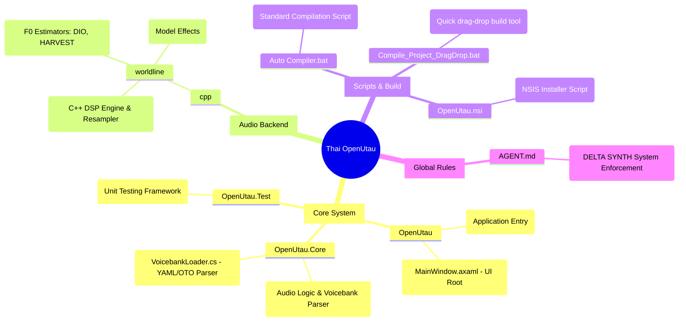

# The Source Code of System File's Name Mapping

**Thai OpenUtau by DELTA SYNTH - Core System Architecture Mapping**

## System File Descriptions

- **`OpenUtau/`**: 
  - *หน้าที่หลัก:* โฟลเดอร์ที่บรรจุส่วนต่อประสานผู้ใช้ (UI) และจุดเริ่มต้นการทำงานของโปรแกรม สร้างบนสถาปัตยกรรม Avalonia UI ข้ามแพลตฟอร์ม
- **`OpenUtau.Core/`**:
  - *หน้าที่หลัก:* แกนสมองประมวลผลของระบบ จัดการตั้งแต่การอ่านไฟล์ Voicebank (`VoicebankLoader.cs`), การจัดการค่าตารางเสียง (`oto.ini`), และการแปลโครงสร้าง YAML ของโปรเจกต์
- **`cpp/worldline/`**:
  - *หน้าที่หลัก:* โมดูล C++ สำหรับเอนจิน Worldline ประมวลผลเสียงระดับต่ำ (DSP) และดึงค่า F0 (Pitch) ด้วยอัลกอริทึม DIO/HARVEST
- **`Auto Compiler.bat`**:
  - *หน้าที่หลัก:* สคริปต์คอมไพล์ระบบหลักที่ข้ามผ่านข้อจำกัดของ Sandbox
- **`OpenUtau.nsi`**:
  - *หน้าที่หลัก:* สคริปต์ NSIS สำหรับบิลด์เป็นไฟล์ติดตั้ง `.exe` หรือ `.msi` 
